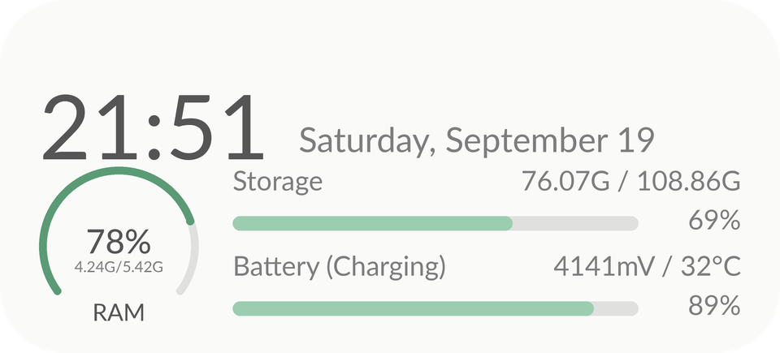
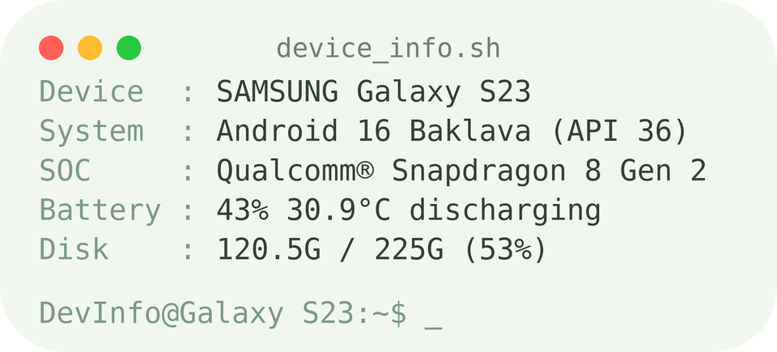
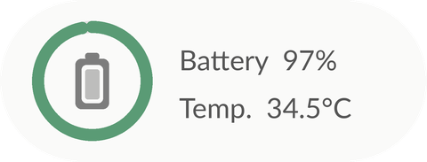
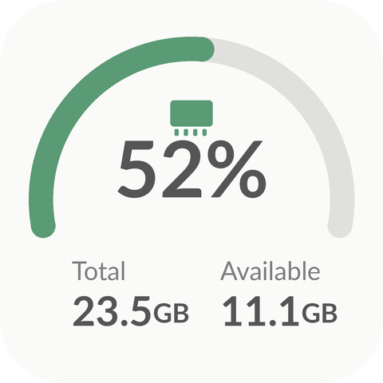

# RAM & ROM Widget

[Tiếng Việt](README.md) · **English**

An Android app (plain Java, no third-party libraries) that gives you **8 home-screen widgets** for **RAM, internal storage (ROM),
battery and device info**, refreshed in real time. No root, no Internet permission, no data collection.

> Author: Vũ Đình Đạt · [@Vudinhdat02](https://github.com/Vudinhdat02)

## Features

- **8 widget styles**: rings, gauges, progress bars, a terminal look, a device-info card...
- **Live updates** (about every 3 s) while the screen is on. When the screen is off nothing runs, so battery impact is minimal.
- **In-app preview**: every widget is shown with your device's real numbers and has an *Add to home screen* button.
- **Clean RAM button** (in the app and on the 2×4 widget): stops background apps and clears this app's own cache.
- **Widget appearance**: adjust the background **transparency** (0-100%) and turn on a **Liquid Glass** effect - applies to every widget.
- **Material You** colors, automatic **light/dark** theme, **English + Vietnamese**.
- Requires **Android 12+** (API 31).

## Widgets

| Widget | Size | Shows |
|---|---|---|
| Device info | 4×2 | Clock + date, RAM ring, storage bar, battery bar (mV / temperature) |
| Terminal style | 4×2 | Device name, Android version, chip, battery, disk in a terminal look |
| RAM usage | 2×1 | Usage ring on the left (same shape as the Storage widget) and RAM used |
| Internal storage | 2×1 | Usage ring and free space |
| Battery | 2×1 | Battery ring, level, temperature (bolt while charging) |
| RAM details | 2×2 | Large gauge, usage %, total and available |
| RAM & ROM 2×2 | 2×2 | Square: two % rings stacked (ROM on top, RAM below) with labels |
| RAM & ROM 2×4 | 4×2 | Two progress bars with sizes + clean RAM button |

<p>
  
  
</p>
<p>
  
  
  
  
</p>

(Illustrative renders; the real widgets use your system font.)

## Install

1. Download the latest `app-release.apk` from **[Releases](../../releases)** (or build it yourself, see below).
2. Open the APK on your phone and allow **Install unknown apps** for your browser/file manager if asked.
3. **Open the app once** after installing so it can start the live updater for your widgets.

## Usage

- **Add a widget from the app (with preview):** open the app, scroll to *Home screen widgets*, look at the previews, tap **Add to home screen**.
- **Add a widget from the launcher:** long-press an empty spot on the home screen → **Widgets** → **RAM & ROM** → pick one.
- Tap any widget to open the details screen.
- **Transparency / Liquid Glass:** in the app, use the *Widget appearance* card above the widget list. The previews update as you drag; home-screen widgets update when you release.
  Launchers don't let widgets blur the wallpaper behind them, so the glass look is a gradient-and-highlight simulation rather than a real blur.
- **Clean RAM:** tap the button in the app (or the round button on the 2×4 widget). Android manages RAM on its own, background apps can restart
  immediately and other apps' caches can't be cleared without root, so the amount freed is often small - that's a system limit, not a bug.
- **Keep widgets live and battery-friendly:** open the app once after each install/update and set the app's battery usage to **Unrestricted**
  (Samsung: Settings → Battery → Background usage limits → remove the app from sleeping apps).

## FAQ

- **Widget doesn't update?** Open the app once and set battery usage to *Unrestricted*. Some vendors (Xiaomi, Oppo, Samsung...) aggressively stop background services.
- **Why is there a small notification?** Android requires a foreground service to show one. It's minimum importance: silent, no status-bar icon.
- **Odd chip name?** Chip codes are translated to marketing names via a table in `DeviceInfo.java` (Snapdragon, Exynos, Dimensity, Tensor). Unknown chips show the raw code - feel free to extend the table.
- **Device name?** Taken from *Settings → About phone → Device name*.

## Permissions & privacy

| Permission | Why |
|---|---|
| `KILL_BACKGROUND_PROCESSES` | Stop background apps when you tap Clean RAM |
| `FOREGROUND_SERVICE`, `FOREGROUND_SERVICE_SPECIAL_USE` | Keep widgets live (only runs while the screen is on) |
| `RECEIVE_BOOT_COMPLETED` | Restart live updates after reboot or app update |
| `queries` (launcher / home) | List apps for cleaning without the broad package-visibility permission |

There is **no Internet permission**; nothing leaves your phone.

## Build from source

Requires JDK 17+ and the Android SDK (platform 35).

```bash
./gradlew assembleRelease        # Windows: gradlew.bat assembleRelease
```

Output: `app/build/outputs/apk/release/app-release.apk`. Point Gradle to the SDK via `ANDROID_HOME` or `local.properties` (`sdk.dir=...`, not committed).

**Signing:** if `keystore.properties` + `release.jks` exist in the project root they are used (`storeFile`, `storePassword`, `keyAlias`, `keyPassword`);
else a `release.keystore` (restored by CI from a secret) is used with `KEYSTORE_PASSWORD`, `KEY_ALIAS`, `KEY_PASSWORD`;
otherwise the debug key is used so the project still builds. The keystore is git-ignored - never commit it. APKs signed with different keys can't be installed over each other.

**GitHub Actions:** `.github/workflows/build.yml` builds on every push to `main` / pull request (artifact `RAM-ROM-apk`) and publishes the APK to **Releases** when you push a tag like `v1.2`.
To sign CI builds with your own key add the repository secret `KEYSTORE_BASE64` (`base64 -w0 release.jks`) together with `KEYSTORE_PASSWORD`, `KEY_ALIAS` (`memwidget`) and `KEY_PASSWORD` (values are in `keystore.properties`). Back up `release.jks` and `keystore.properties` somewhere safe.

## Contributing

Issues and pull requests are welcome: new widget styles, more chip names, or translations (add `values-xx/strings.xml`).
