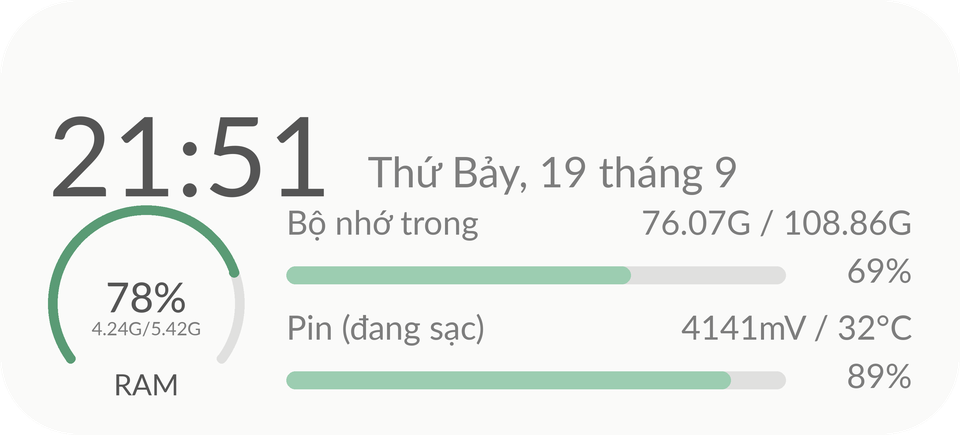
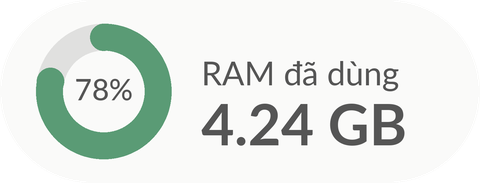
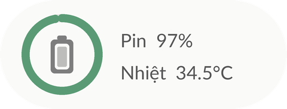
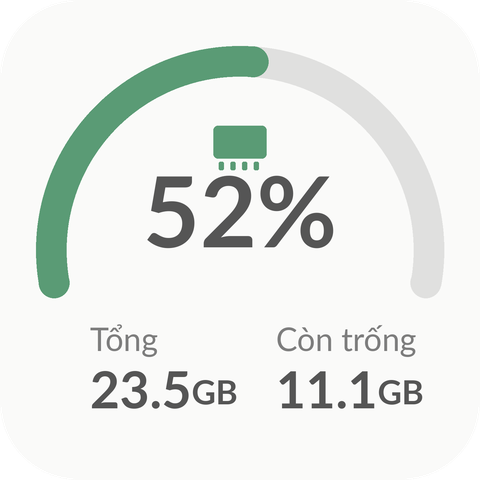

# RAM & ROM Widget

**Tiếng Việt** · [English](README.en.md)

Ứng dụng Android (Java thuần, không dùng thư viện bên thứ ba) cung cấp **8 widget** màn hình chính để theo dõi
**RAM, bộ nhớ trong (ROM), pin và thông tin máy** ngay trên màn hình chính, cập nhật theo thời gian thực.
Không cần root, không xin quyền Internet, không thu thập dữ liệu.

> Tác giả: Vũ Đình Đạt · [@Vudinhdat02](https://github.com/Vudinhdat02)

## Tính năng

- **8 mẫu widget** để chọn theo sở thích: vòng tròn, cung đo, thanh tiến trình, kiểu terminal, thẻ thông tin thiết bị...
- **Cập nhật trực tiếp** (~3 giây/lần) khi màn hình bật; tắt màn hình là dừng hoàn toàn nên gần như không tốn pin.
- **Xem trước ngay trong app**: mỗi widget có hình xem trước hiển thị số liệu thật của máy bạn và nút *Thêm vào màn hình chính*.
- **Nút dọn RAM** (trong app và trên widget 2×4): dừng các ứng dụng đang chạy nền và xóa cache của chính app này.
- **Tùy chỉnh giao diện widget**: chỉnh **độ trong suốt** của nền (0-100%) và bật **hiệu ứng kính (Liquid Glass)** - áp dụng cho mọi widget.
- Màu **Material You** (theo hình nền), giao diện **sáng/tối** tự động, hỗ trợ **tiếng Việt + tiếng Anh**.
- Yêu cầu **Android 12 trở lên** (API 31+).

## Các widget

| Widget | Kích thước | Hiển thị |
|---|---|---|
| Thông tin thiết bị | 4×2 | Đồng hồ + ngày, vòng RAM, thanh bộ nhớ trong, thanh pin (mV / nhiệt độ) |
| Kiểu terminal | 4×2 | Tên máy, phiên bản Android, chip, pin, ổ đĩa theo phong cách terminal |
| RAM sử dụng | 2×1 | Vòng % bên trái (giống widget Bộ nhớ trong) và dung lượng RAM đã dùng |
| Bộ nhớ trong | 2×1 | Vòng % và dung lượng còn trống |
| Pin | 2×1 | Vòng pin, % pin, nhiệt độ (có tia sét khi đang sạc) |
| RAM chi tiết | 2×2 | Cung đo lớn, % dùng, tổng và dung lượng còn trống |
| RAM & ROM 2×2 | 2×2 | Hình vuông: hai vòng % xếp dọc (ROM trên, RAM dưới) kèm nhãn |
| RAM & ROM 2×4 | 4×2 | Hai thanh tiến trình kèm dung lượng + nút dọn RAM |

Ảnh minh họa (dựng từ script, hình thật trên máy có thể lệch đôi chút do phông chữ của hệ thống):

<p>
  
  
</p>
<p>
  
  
  
  
</p>

## Cài đặt

1. Vào mục **[Releases](../../releases)** của repo này và tải file `app-release.apk` mới nhất
   (hoặc tự build theo phần [Build từ mã nguồn](#build-từ-mã-nguồn)).
2. Mở file APK trên điện thoại. Nếu máy hỏi, cho phép **Cài đặt ứng dụng không rõ nguồn gốc** cho trình duyệt/trình quản lý file bạn đang dùng.
3. Cài đặt xong, **mở app một lần** (bước này để app bật bộ cập nhật trực tiếp cho widget).

## Hướng dẫn sử dụng

### Thêm widget vào màn hình chính

**Cách 1 - ngay trong app (có xem trước):** mở app, kéo xuống mục *Widget màn hình chính*, xem hình từng widget,
bấm **Thêm vào màn hình chính** ở widget bạn thích rồi xác nhận.

**Cách 2 - từ launcher:** nhấn giữ vào chỗ trống trên màn hình chính → **Widget** → tìm **RAM & ROM** → chọn mẫu → kéo ra màn hình.

Chạm vào bất kỳ widget nào để mở màn hình chi tiết của app.

### Độ trong suốt và hiệu ứng kính

Trong app, mục *Giao diện widget* (phía trên danh sách widget): kéo thanh **Độ trong suốt** để làm nền widget trong hơn, bật công tắc
**Hiệu ứng kính (Liquid Glass)** để nền mờ như kính có viền sáng. Hình xem trước đổi ngay khi bạn chỉnh, widget trên màn hình chính đổi khi bạn thả tay.
Launcher không cho widget làm mờ hình nền phía sau, nên hiệu ứng kính là bản mô phỏng bằng gradient và viền sáng chứ không phải làm mờ thật.

### Dọn RAM

Bấm **Dọn RAM** trong app (hoặc nút tròn trên widget 2×4). App sẽ dừng các ứng dụng đang chạy nền và xóa cache của chính nó,
rồi báo lượng RAM giải phóng được.

> Android tự quản lý RAM rất tốt, nhiều ứng dụng nền có thể tự mở lại ngay và cache của app khác không xóa được nếu không có root.
> Vì vậy nhiều lúc lượng RAM giải phóng rất nhỏ - đây là giới hạn của hệ thống chứ không phải lỗi.

### Để widget luôn cập nhật, tiết kiệm pin

- Mở app **ít nhất một lần** sau khi cài hoặc sau khi cập nhật bản mới.
- Đặt pin cho app ở mức **Không hạn chế** (Cài đặt → Ứng dụng → RAM & ROM → Pin → Không hạn chế).
  Trên Samsung: Cài đặt → Pin → *Giới hạn sử dụng nền* → bỏ app khỏi danh sách "ứng dụng ngủ".
- Widget cập nhật mỗi ~3 giây khi màn hình bật (10 giây nếu bật Tiết kiệm pin), chỉ đẩy dữ liệu khi con số hiển thị thực sự đổi.
  Khi tắt màn hình, app không làm gì cả.

## Câu hỏi thường gặp

**Widget không tự cập nhật?** Mở app một lần, đặt pin ở mức *Không hạn chế* (xem trên). Một số hãng máy (Xiaomi, Oppo, Samsung...) hay tắt dịch vụ nền của app.

**Vì sao có một thông báo nhỏ của app?** Android yêu cầu dịch vụ nền phải có thông báo. Thông báo này ở mức thấp nhất, không phát âm thanh và không hiện biểu tượng trên thanh trạng thái.
Trên Android 13+, nếu bạn không cấp quyền thông báo thì nó vẫn chạy bình thường, chỉ là không hiển thị.

**Tên chip hiện mã lạ?** App nhận dạng chip từ mã do hãng cung cấp và có sẵn bảng đổi sang tên thương mại cho các dòng Snapdragon, Exynos, Dimensity, Tensor phổ biến.
Chip chưa có trong bảng sẽ hiện mã gốc. Bạn có thể bổ sung ở `DeviceInfo.java`.

**Tên máy không đúng ý?** App lấy *tên thiết bị* trong Cài đặt → Thông tin điện thoại. Đổi tên ở đó là widget đổi theo.

**Widget vuông/lệch?** Widget 2×2 tự tính kích thước theo ô mà launcher cấp và luôn vẽ hình vuông ở giữa ô.

## Quyền ứng dụng & quyền riêng tư

| Quyền | Dùng để làm gì |
|---|---|
| `KILL_BACKGROUND_PROCESSES` | Dừng ứng dụng chạy nền khi bấm Dọn RAM |
| `FOREGROUND_SERVICE`, `FOREGROUND_SERVICE_SPECIAL_USE` | Dịch vụ giữ widget cập nhật trực tiếp (chỉ chạy khi màn hình bật) |
| `RECEIVE_BOOT_COMPLETED` | Tự bật lại cập nhật sau khi khởi động máy hoặc cập nhật app |
| Khai báo `queries` (launcher / home) | Liệt kê ứng dụng để dọn RAM, không cần quyền xem toàn bộ danh sách app |

App **không có quyền Internet**, không thu thập hay gửi dữ liệu đi đâu. Mọi số liệu (RAM, bộ nhớ, pin, thông tin máy) đọc trực tiếp từ hệ thống ngay trên máy bạn.

## Build từ mã nguồn

Cần JDK 17+ và Android SDK (platform 35).

**Android Studio:** mở thư mục dự án → đợi Gradle sync → mở *Build Variants* (góc dưới bên trái) và chọn `release` → *Build > Build APK(s)*.
(Nếu để `debug` thì ra bản debug, không phải bản ký bằng khóa của bạn.)

**Dòng lệnh:**

```bash
./gradlew assembleRelease        # Windows: gradlew.bat assembleRelease
```

APK nằm ở `app/build/outputs/apk/release/app-release.apk`. Cần khai báo đường dẫn SDK qua biến môi trường `ANDROID_HOME`
hoặc file `local.properties` (`sdk.dir=...`, file này không được đưa lên Git).

### Ký APK

- Có `keystore.properties` + `release.jks` ở thư mục gốc thì bản `release` được ký bằng khóa đó. File `keystore.properties` gồm 4 dòng:

  ```properties
  storeFile=release.jks
  storePassword=MAT_KHAU_CUA_BAN
  keyAlias=memwidget
  keyPassword=MAT_KHAU_CUA_BAN
  ```
- Không có hai file trên nhưng có `release.keystore` (GitHub Actions tự tạo từ secret) thì dùng khóa này, mật khẩu đọc từ biến môi trường
  `KEYSTORE_PASSWORD`, `KEY_ALIAS`, `KEY_PASSWORD`.
- Không có gì cả thì gradle dùng khóa debug để vẫn build được.
- Các file khóa **không nằm trong repo** (đã chặn trong `.gitignore`). APK ký bằng hai khóa khác nhau thì không cài đè lên nhau được,
  nên hãy luôn dùng cùng một khóa và **sao lưu `release.jks` + `keystore.properties`** ở nơi an toàn. Mất khóa là không cập nhật được app đã phát hành.
- Tạo khóa mới:

  ```bash
  keytool -genkeypair -v -keystore release.jks -storetype PKCS12 -alias memwidget -keyalg RSA -keysize 2048 -validity 36500
  ```

### Build tự động bằng GitHub Actions

Repo đã có workflow `.github/workflows/build.yml`:

- Mỗi lần push lên `main` hoặc tạo pull request, GitHub tự build và lưu APK trong *Actions → lần chạy → Artifacts → RAM-ROM-apk*.
- Đẩy một tag dạng `v1.2` thì APK còn được **tự đăng vào mục Releases**:

  ```bash
  git tag v1.2
  git push origin v1.2
  ```
- Muốn APK trên GitHub ký bằng khóa của bạn: vào *Settings → Secrets and variables → Actions* và thêm
  `KEYSTORE_BASE64` (nội dung base64 của file khóa: `base64 -w0 release.jks`), cùng `KEYSTORE_PASSWORD`, `KEY_ALIAS` (`memwidget`) và `KEY_PASSWORD` (đều lấy trong `keystore.properties`).

## Cấu trúc mã nguồn

```
app/src/main/java/com/vdd/memwidget/
  MainActivity.java        Màn hình chính: chi tiết RAM/ROM, dọn RAM, thư viện widget có xem trước
  WidgetStyle.java         Tuỳ chọn độ trong suốt / hiệu ứng kính và cách gắn vào nền widget
  WidgetKinds.java         Danh sách 8 widget, kích thước, khóa chống cập nhật thừa
  WidgetViews.java         Dựng giao diện (RemoteViews) cho từng widget, tự co giãn theo cỡ thật
  WidgetUpdater.java       Đẩy cập nhật cho các widget (chỉ khi dữ liệu / kích thước / giao diện đổi)
  MonitorService.java      Dịch vụ nền cập nhật trực tiếp, chỉ chạy khi màn hình bật
  Gauges.java              Vẽ cung/vòng tròn bo đầu thành bitmap
  MemStats.java, BatteryInfo.java, DeviceInfo.java, Snapshot.java   Đọc số liệu RAM / ROM / pin / thông tin máy
  MemCleaner.java          Dọn RAM
  *WidgetProvider.java     Mỗi widget một provider (khai báo trong AndroidManifest.xml)
app/src/main/res/          Layout widget, màu, chuỗi (values = English, values-vi = Tiếng Việt), ảnh preview
```

## Đóng góp

Mở *Issue* hoặc *Pull request* nếu bạn muốn thêm mẫu widget, bổ sung tên chip, hoặc dịch sang ngôn ngữ khác
(thêm thư mục `values-xx/strings.xml`).
